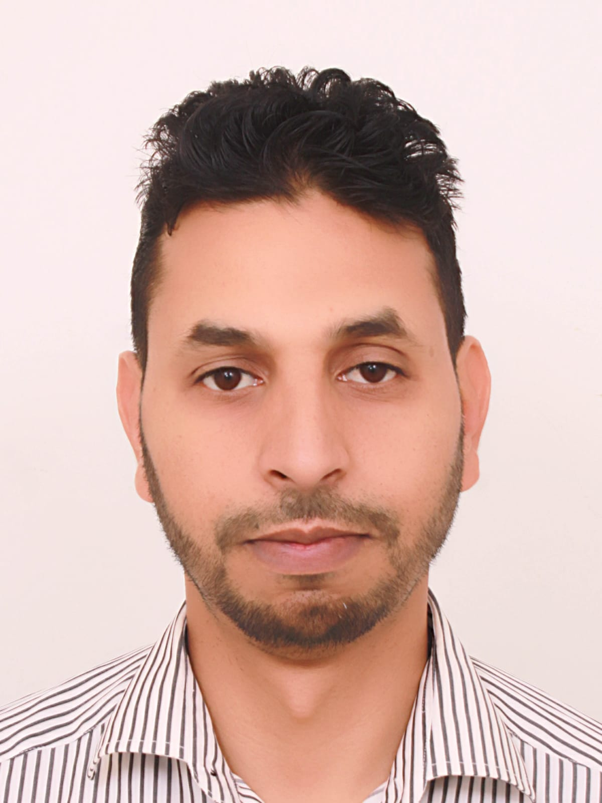

<!DOCTYPE html>
<html lang="fr">
<head>
<meta charset="UTF-8">
<meta name="viewport" content="width=device-width, initial-scale=1.0">
<title>CV Ayoub </title>

</head>
<body>

    
📄 Télécharger PDF

    
🖨️ Print

    <!-- HEADER -->

    <!-- LEFT SIDE -->
    

        

        

        <h1>Ay</h1>
        
HSSE Specialist | Risk Management | Onshore/ Offshore Construction & Oil&Gas Safety

            

                
📞 +212 xxxxxxxx

                
📧 test@gmail.com

                
🔗 linkedin.com/in/b

            

        

    

    <!-- RIGHT SIDE QR -->
    

         
        Scan LinkedIn
    

 

    <!-- PROFIL -->
    

        <h2>Profil</h2>
        
HSSE Specialist expérimenté en gestion des risques, audits et supervision chantier. Leadership terrain et réduction d’incidents. Capacité à influencer et motiver les équipes pour atteindre les objectifs HSE.

    

    <!-- EXPÉRIENCE -->
    

        <h2>Expérience Professionnelle</h2>
        
<b>Project HSE Lead – JESA Group</b> (2023 – Présent)

        
<b>August 2025- Present:</b> Project 2: Renovation of Campus UM6P Terraces in Casablanca

        
<b>May 2023- July 2025:</b> Project 1: Construction of new Phosphate Port in
         Laayoune

        <ul>
         <li>Review HSE Plans, Procedures, Method Statements, Risk assessments for
          the projects, & all Health, Safety & Environment related documentation to
         ensure compliance with the company requirements and regulations ;</li>
          <li>Monitor implementation of environmental mitigation measures during
           construction phases;</li>
           <li>Participate in regular site audits & inspections, and follow up actions plans.</li>
           <li>Participate in investigations of incidents, and issue related HSE reports.</li>
           <li>Collect and report relevant information as per the standard reporting in
           place.</li>
           <li>Regular meeting with client and contractors;</li>
            <li>Follow-up of HSE KPIs.</li>
             <li>Follow-up with contractors the regulatory verifications of equipment & its
           compliance ;</li>

        </ul>

        
<b>IMS/HSSE Coordinator – HTTSA/ ENOC"Emirate National oil&Gas company</b> (2011 – 2023)

      
         <ul>
         <li>HSSE support to HTTSA Employees and ensure that all practices are
         compliance to HTTSA’s EHSSQ & En policy & Requirements;</li>
         <li>Participate in the implementation and improvement of IMS System: ISO
         14001:2015, 45001:2018, ISO50001: 2018 and other certifications;</li>
       <li>Health/Safety Risk assessment and Environmental Impact Assessment;</li>
        <li>HSE projects follow up;</li>
        <li>Follow-up of regulatory verifications of equipment;</li>
        <li>Follow-up of environmental studies, surveys and the application of the
         environmental monitoring and surveillance plan “PSSE”.</li>
       <li>Participate in the investigation and analysis of incidents as and when
       required;</li>
       <li>Acting as Security correspondent, coordinate with public or port
       authorities since required;</li>
      <li>Conduct EHS Inspections/ HSE Contractors Audit;</li>
      <li>Conduct safety induction and EHS Campaigns;</li>
      <li>Ensure the implementation of trainings Programme;</li>
      <li>Supervision of security teams and CCTV teams.</li>
      <li>Firefighting incident controler</li>

        </ul>

    

    <!-- COMPÉTENCES -->
    

        <h2>Compétences</h2>
        Risk Management
        ISO 45001/ISO1400
        Audit HSE
        Leadership
        Incident Analysis
        Construction Safety
        Marine Construction Safety
        Asset & Oil&Gas Safety
        Firefighting Management
    

    <!-- FORMATION -->
    

        <h2>Formation</h2>
        
<b>Inprogress 2026/2027: NEBOSH International Diploma L6</b> for Occupational Health and Safety
        Management Professionals (Bachelor degree equivalent)         /UK E-learning
 
        
<b>2021: NEBOSH International generale Certificate L3</b> for Occupational health and safety management/ Hazards and control measures /ISCollege Casablanca
  
        
<b>2020/2022: Master degree </b>: Management of quality, safety and environmental

        
Project theme: Implementation of the occupational health and safety management system ISO45001 /FST Settat
 
        
<b>2018: </b>Leading Safety Performance  /Conducted by Mr Daryl WAKE, Senior consultant in DEKRA

        
<b>2015: </b>Oil&Gas Terminal Supervisors Course  / The Centre for Maritime & Industrial Safety Technology Limited in UAE

        
<b>2010: Bachelor degree </b>: in Electrical Engineering  /FST Settat

        
<b>2007: Bac (scientific)</b>  /Sidi kacem

   
    

    <!-- CENTRES D'INTERET -->
    

        <h2>Centres d'intérêt</h2>
        

            Coding & Creativity
            Voyage
            Lecture
            Sports
            Technologies
        

    

</body>
</html>
